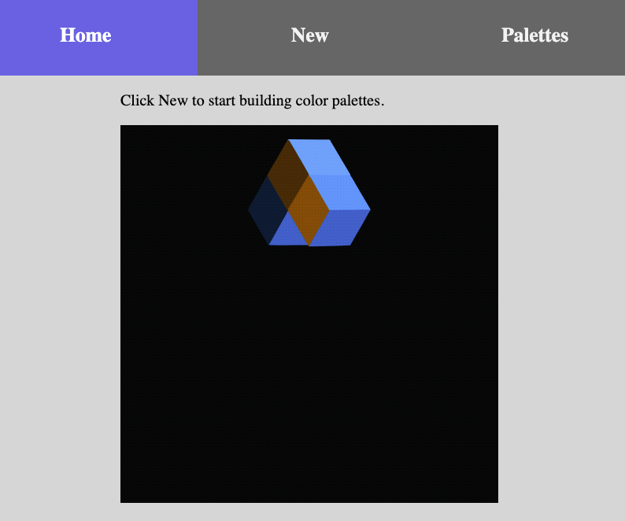
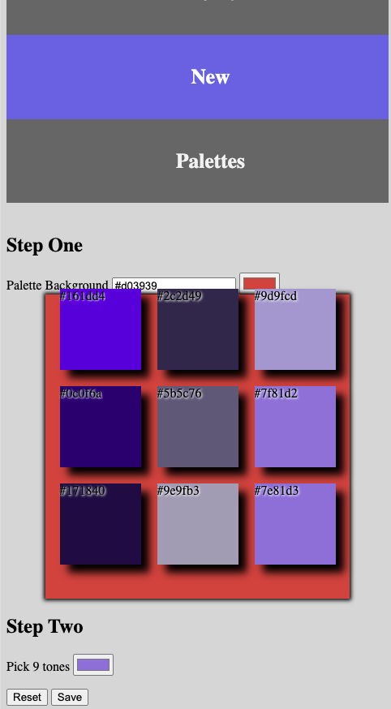
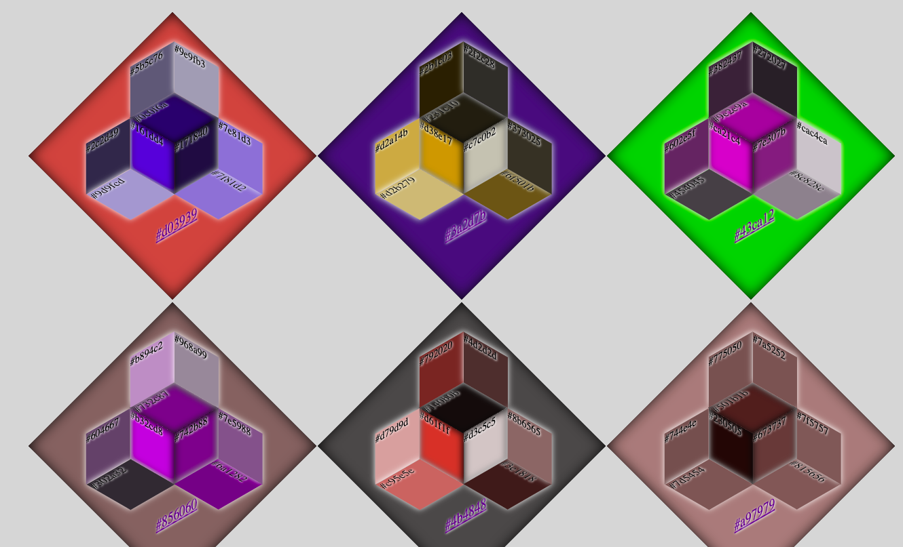

# README

This Palettes Project is a Single Page Application(SPA)
This SPA integrates HTML, CSS, and JavaScript with a Rails API backend. 

# USAGE

A user may choose a background color for their palette. 
A user may fill their palette with up to 9 other color tones. 
A use may also view all palettes. 

# STARTUP

To get the application up an running, clone this repoisotry and navigate to the project directory. 

palettes-project
    app
    bin
    config
    frontend
    db
    gemfile
    ....

Bundle install and type "rails s" to launch the rails servers.

Then navigate to the "frontend" directory within palettes-project

Type "open index.html" 

The page will load with the "Home" tap selected. 

Click "New" to start creating color palettes. 

The "Palettes Index" will be empty until creations are added.

* Ruby version
Rails version: 6.0.3.4
Ruby version: ruby 2.6.1p33 (2019-01-30 revision 66950) [x86_64-darwin19]

# License

Palettes Project is licensed under the MIT license. (http://opensource.org/licenses/MIT)
